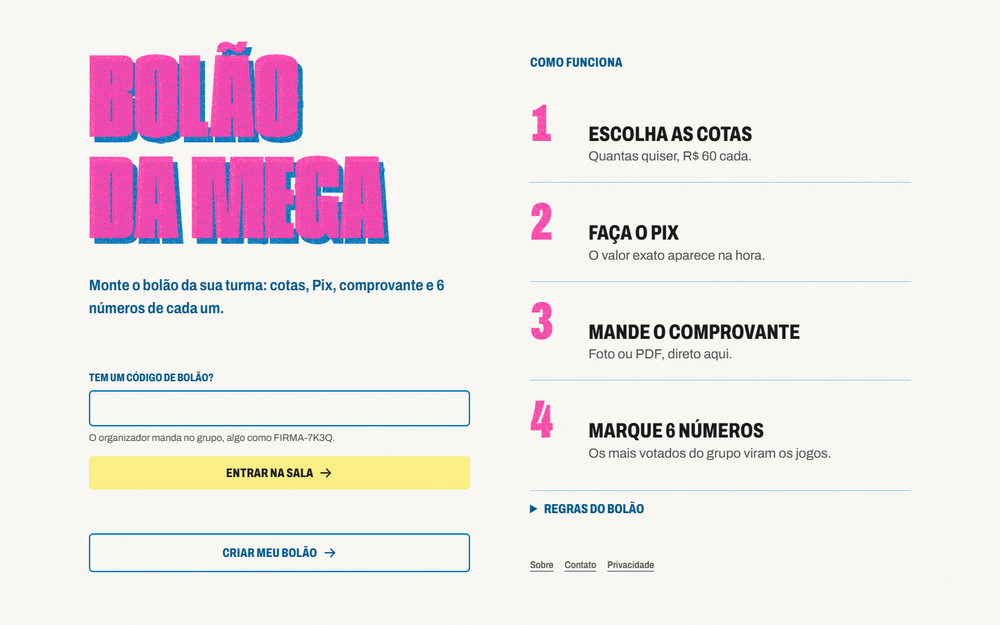
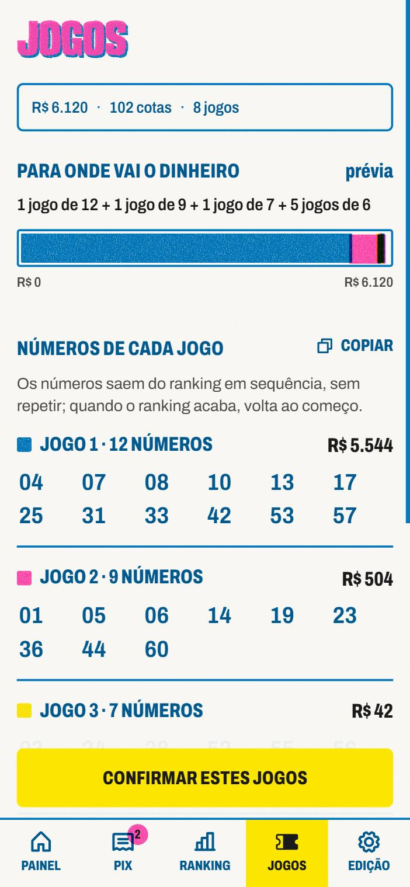

# Bolão da Mega

A web app for running an office lottery pool for Brazil's New Year's Eve *Mega da Virada* draw, designed as a risograph zine. **[bolaodamega.avaaraujo.com](https://bolaodamega.avaaraujo.com)**



<p>
  
  
</p>

## Why I built it

Every year I organize the office pool. Until now that meant collecting Pix transfers, chasing receipts over chat and keeping a spreadsheet. This app replaces all of it. People join from a link on their phone, pay, upload the receipt and pick their 6 numbers. I approve the payments in one place, and the app builds the bets.

## Design and product decisions

- **The group votes on the numbers.** The most picked numbers fill the games in order, biggest game first, until the money runs out. Rules live in `src/lib/rules.ts` and have tests.
- **Mobile first, for everyone.** Participants and the organizer both use it on their phones, so every screen starts at 390px.
- **A risograph zine, not a fintech app.** Misregistered two-ink type, stamps and a halftone heatmap give it the loose feel of an office tradition. GSAP motion respects `prefers-reduced-motion`.
- **AI reads, the rules decide.** Claude only reads the Pix receipt (amount, time, recipient). Tested rules approve the clear cases, reject the objective failures and send anything odd to a human.
- **Many pools.** Anyone can create a pool with its own code, isolated by row-level security.

**Stack:** Next.js, Supabase (Postgres, Auth, Storage, RLS), Claude API, GSAP, Vitest, Vercel.

**Built with AI.** I write the code with Claude Code as a pair. The design and product decisions are mine.

---

## Documentação técnica (em português)

## Rodar

```bash
npm install
npm run dev
```

Testes das regras: `npx vitest run`.

## Várias salas (multi-bolão)

Cada bolão é uma sala isolada, identificada por um código aleatório (ex.: `FIRMA-7K3Q`), com dono, valores, Pix, participantes e jogos próprios.

- `/` entrada: digitar o código da sala, ou criar o próprio bolão.
- `/admin` conta de organizador (login) e lista dos seus bolões, com "Criar bolão".
- `/b/[código]` página da sala; `/b/[código]/entrar`, `/b/[código]/resultado`.
- `/b/[código]/p/[token]` link pessoal do participante (`/pagamento`, `/volante`).
- `/b/[código]/admin/*` painel daquele bolão (só o dono).

Qualquer pessoa pode criar uma conta de organizador e gerar o seu bolão; um organizador nunca vê as salas de outro (RLS por `owner_id`).

## Modo demo

`NEXT_PUBLIC_DATA_SOURCE=mock` (padrão): tudo roda no navegador (localStorage), uma sala por código. Existe a sala de exemplo `DEMO-2026` (44 participantes, 102 cotas aprovadas, R$ 6.120) e dá para criar outras. O login do organizador não tem senha de verdade. Em **Edição → Restaurar** a sala volta ao início.

## Supabase

1. Criar um projeto e rodar `supabase/schema.sql` (tabelas `bolaos` e `participants`, RLS, funções para o participante, bucket privado `comprovantes`).
2. Copiar `.env.example` para `.env.local` e preencher: `NEXT_PUBLIC_DATA_SOURCE=supabase`, `NEXT_PUBLIC_SUPABASE_URL`, `NEXT_PUBLIC_SUPABASE_ANON_KEY` (a chave anon/publishable é pública por desenho; a segurança está na RLS). Na Vercel, as mesmas variáveis.
3. Em Authentication, ajustar a confirmação de e-mail e o redirect conforme o domínio.

Participantes não têm conta: entram pelo código e usam o token do link pessoal, sempre por funções do banco (`join_bolao`, `set_numbers`, `attach_receipt`, `get_public_snapshot`). Dados reais ficam só no banco, nunca no repositório (`.env*` é ignorado, exceto `.env.example`).

## Conferência de Pix por IA

Quando o participante manda o comprovante, `POST /api/comprovantes/conferir` baixa o arquivo do bucket e pede ao Claude (padrão `claude-haiku-4-5`, troque com `PIX_REVIEW_MODEL`) só a **leitura** dos campos: valor, data e hora, destinatário, chave, pagador, ID da transação e sinais de edição. Quem decide são as regras em `src/lib/pix-check.ts`, que são testadas:

- **aprova sozinho** quando conta, valor exato e horário (entre 2 h antes da inscrição e o envio) batem;
- **recusa sozinho** só o que é objetivo: não é Pix, foi para outra pessoa, ou valor a menos;
- **manda para você** qualquer caso estranho: print antigo, valor a mais, mesmo ID de transação de outro participante, sinais de edição, campo ilegível.

Só funciona para organizadores listados em `public.ai_reviewers` (hoje, a conta do Avá); nos outros bolões o envio segue como antes. Precisa de `ANTHROPIC_API_KEY` e `SUPABASE_SERVICE_ROLE_KEY` no servidor (Vercel). Cada comprovante é lido uma vez (`claim_ai_check`), com no máximo 8 leituras por participante. Na tela de Pagamentos, comprovantes ainda sem leitura são lidos sozinhos ao abrir a tela, e dá para pedir "Ler de novo".

## Movimento

Animações em GSAP (`src/components/motion.tsx`), na linguagem da risografia: títulos entram em duas passadas de tinta fora de registro, valores contam como contador, carimbos respingam, barras de custo e ranking imprimem em passadas, o mapa de calor cai do centro e as dezenas dos jogos quicam. Tudo respeita `prefers-reduced-motion` e não deixa `transform` preso nos elementos.

## Onde está cada coisa

- `src/lib/rules.ts`: custo dos jogos, divisão gulosa, ranking com desempate, montagem dos jogos.
- `src/lib/data/`: interfaces (`DataSource` por sala, `Platform` para contas e lista), mock, seed e Supabase.
- `src/components/riso.tsx`, `volante.tsx`, `jogos.tsx`: o sistema visual riso.
- `src/app/`: landing (`/`), organizador (`/admin`) e salas (`/b/[código]/...`).

## Para agentes de IA

- `Accept: text/markdown` em qualquer página pública devolve Markdown (`src/proxy.ts`, `src/lib/agent/`); caminhos inexistentes dão 404 também em Markdown.
- `/llms.txt`, `/sitemap.xml`, `/robots.txt`, JSON-LD na home e páginas `/about`, `/contact`, `/privacy`, `/developers`.
- Servidor MCP público e somente leitura (Streamable HTTP) em `/mcp` e `/.well-known/mcp`: `get_bolao_info`, `calculate_game_plan`, `calculate_game_cost`.
- Contato público opcional (entra na página de contato e no JSON-LD só se definido): `NEXT_PUBLIC_CONTACT_EMAIL`, `NEXT_PUBLIC_ADDRESS_LOCALITY`, `NEXT_PUBLIC_ADDRESS_COUNTRY` (+ `_STREET`, `_REGION`, `_POSTAL_CODE`).
